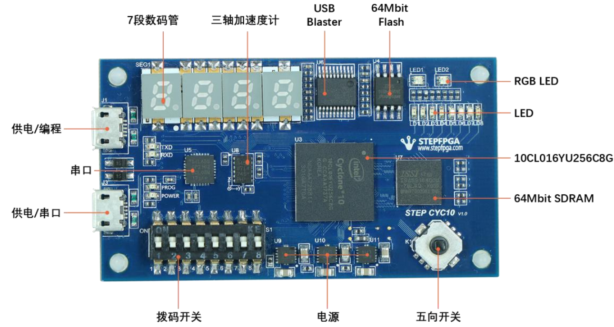
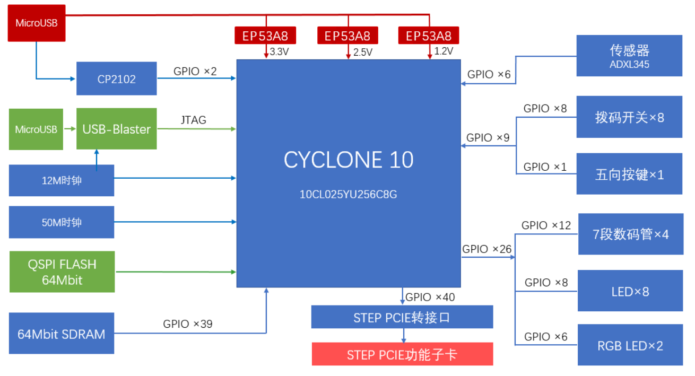
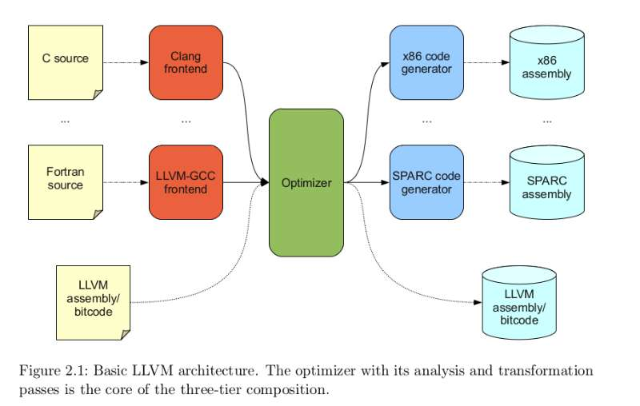

# 轻量OS在“小脚丫”FPGA开发板上的实现

计53班 张天扬， 王延森，戴臻旸

## 引言

目前使用的FPGA开发板价格都比较昂贵，其元件也较为复杂；以Linux为代表的开源操作系统都致力于使操作系统尽可能功能完善，但也使得其越来越复杂。这些因素为本科生教学工作中计算机组成原理和操作系统的实验带来了较大的困难。

在前期调研中，我们发现“小脚丫”公司开发的STEP系列是为初学者打造的一个FPGA入门平台，提供了一套极其精简的可编程逻辑器件平台，为FPGA初学者提供了物美价廉的学习环境。同时，recc是一个由国外团队RobertElder开发的极其精简的教学用操作系统，实现了操作系统的基本框架以理解基本原理。

在本项目中，我们将二者结合，实现一整套尽可能精简的“CPU+OS+Compiler”实验平台，用于今后可能的教学研究工作。 

## 项目贡献

- 修改、设计了整套指令系统，由19条指令组成。
- 完成了针对该指令系统的CPU模拟与实现。
- 实现了针对该套指令系统的C代码编译器。
- 提供了使用该指令系统的极小型操作系统，并在模拟和实际环境中测试完成。

## 使用说明

### 项目构建环境

推荐使用 Linux 环境。 要求 

* cmake：3.5.1
* clang：3.9.0 or 3.8.0, 注意 clang 更新和更老的版本都不行
* make：4.1
* GNU binutils：2.26.1

视机器配置， 构建过程可能花费二十分钟到一小时不等。

### 构建编译器

在仓库目录 `OS2018spring-projects-g02/` 下， 执行
```
$ cd llvm-3.9.0.src
$ mkdir build && cd build
$ cmake -DCMAKE_CXX_COMPILER=clang++ -DCMAKE_C_COMPILER=clang -DCMAKE_BUILD_TYPE=Debug -DLLVM_INCLUDE_TESTS=OFF -DLLVM_INCLUDE_EXAMPLES=OFF -G "Unix Makefiles" ..
$ make llc llvm-mc lld      # 机器性能允许则可以 -jX 并行构建
$ ls bin/
ld.lld  llc  lld  lld-link  llvm-lit  llvm-mc  llvm-tblgen
```
### 构建操作系统

在仓库目录 `OS2018spring-projects-g02/` 下， 执行
```
$ cd recc-kernel-llvm
$ make
$ ls build/a.*
build/a.img  build/a.out
```

### 构建模拟器

在仓库目录 `OS2018spring-projects-g02/` 下， 执行

```
$ cd cpu0-emulator
$ mkdir build && cd build
$ cmake ..
$ make
$ ls cpu0emu
cpu0emu
```

### 在模拟器上运行操作系统

完成以上构建之后， 可以开始在模拟器上运行操作系统了。

模拟器支持运行两种文件

* `a.out`： 可执行的 elf 文件.

* `a.img`： 从 0 开始的内存镜像.

希望运行 `a.out` ，则需要在 OS2018spring-projects-g02/下
```
$ cp recc-kernel-llvm/build/a.out cpu0-emulator/build/
$ cd cpu0-emulator/build
$ ./cpu0emu a.out 0
```

希望运行 `a.img` ，则需要在 `OS2018spring-projects-g02/` 下
```
$ cp recc-kernel-llvm/build/a.img cpu0-emulator/build/
$ cd cpu0-emulator/build
$ ./cpu0emu a.img 0 2
```
执行 `./cpu0emu ...` 后，应当看到如下的输出

```
e_flags=00000000
e_entry=000017bc
region FFFF0000 - FFFF00F4 (244): rwx=100
region 00000000 - 00001CF8 (7416): rwx=101
region 00001D00 - 00001FA1 (673): rwx=100
region 00001FA4 - 0000AA10 (35436): rwx=110
io port 00300000 - 00300100 (256)


> uart direct out: 0000004B    (d=        75)
> uart direct out: 00000045    (d=        69)
> uart direct out: 00000052    (d=        82)
> uart direct out: 00000053    (d=        83)
> uart direct out: 00000055    (d=        85)
> uart direct out: 00000043    (d=        67)
You're currently running a very simple microkernel that was built
for the purposes of demonstrating the 'One Page CPU' design, and
cross compiler collection.  This microkernel implements inter-process
communication, premptive context switching, interrupt based I/O, along
with a very simple timer that counts simulated clock ticks.

Some single-character commands include:

t -  Prints the number of simulated clock ticks since kernel start.
s -  Prints the stack pointer values of each task.
p -  Prints the priority of each task.
```

目前只支持以上三个单字符命令。 命令输出应当类似如下内容
```
t -  Prints the number of simulated clock ticks since kernel start.
s -  Prints the stack pointer values of each task.
p -  Prints the priority of each task.
t
0x2e
s
Task 0x0 SP: 0x0
Task 0x1 SP: 0x34D8
Task 0x2 SP: 0x44E8
Task 0x3 SP: 0x54D8
Task 0x4 SP: 0x6440
Task 0x5 SP: 0x74D8
Task 0x6 SP: 0x84B0
Task 0x7 SP: 0x9478
p
Task 0x0 Priority: 0x5
Task 0x1 Priority: 0x5
Task 0x2 Priority: 0x2
Task 0x3 Priority: 0x0
Task 0x4 Priority: 0x1
Task 0x5 Priority: 0x0
Task 0x6 Priority: 0x1
Task 0x7 Priority: 0x3
t
0x1e2
```

任何时刻， 按下 Ctrl-C 终止模拟器。

### 构建硬件设计

1. 使用Quartus Prime Lite 打开`OS2018spring-projects-g02/litecpu/litecpu.qpf` ，并执行编译综合。
2. 使用USB Blaster（需要安装驱动）将计算机与“小脚丫”STEP-CYC10硬件开发板链接，打开Quartus中的Programmer，将`OS2018spring-projects-g02/litecpu/output_files/litecpu.sof` 下载到硬件开发板中。

### 在硬件上运行操作系统

1. 使用USB线将计算机与STEP-CYC10硬件开发板的串口链接（需要安装串口驱动），向左拨动硬件开发板中的五向开关重置CPU运行。
2. 在PC上运行`OS2018spring-projects-g02/utils/ser.py` ，输入 `file a.img` ，其中系统镜像`a.img` 需要拷贝到当前文件夹下。
3. 输入`start` 即可启动操作系统，此时应该在串口输出端（python程序输出）看到与模拟器输出类似的结果。
4. 之后与模拟器类似使用即可，`ser.py` 会将指令通过串口传输给硬件开发板，再将串口输出结果显示在屏幕上。

## 指令系统设计

### 指令集

为了与操作系统以及编译器更好的适配，我们的指令系统在[One-page CPU](http://recc.robertelder.org/op-cpu.txt)的基础上进行了改动。

指令按格式可以分为R型指令、I型指令、J型指令三种，格式分别如下所示：


```
R型指令：
 31         26 25     21 20     16 15     11 10                0
+-+-+-+-+-+-+-+-+-+-+-+-+-+-+-+-+-+-+-+-+-+-+-+-+-+-+-+-+-+-+-+-+
|  指令编号   |   rx    |   ry    |   rz    |      保留         |
+-+-+-+-+-+-+-+-+-+-+-+-+-+-+-+-+-+-+-+-+-+-+-+-+-+-+-+-+-+-+-+-+
      6            5         5         5              11

I型指令：
 31         26 25     21 20     16 15                          0
+-+-+-+-+-+-+-+-+-+-+-+-+-+-+-+-+-+-+-+-+-+-+-+-+-+-+-+-+-+-+-+-+
|  指令编号   |   rx    |   ry    |             imm             |
+-+-+-+-+-+-+-+-+-+-+-+-+-+-+-+-+-+-+-+-+-+-+-+-+-+-+-+-+-+-+-+-+
      6            5         5                  16       

J型指令：
 31         26 25                                              0
+-+-+-+-+-+-+-+-+-+-+-+-+-+-+-+-+-+-+-+-+-+-+-+-+-+-+-+-+-+-+-+-+
|  指令编号   |                     offset                      |
+-+-+-+-+-+-+-+-+-+-+-+-+-+-+-+-+-+-+-+-+-+-+-+-+-+-+-+-+-+-+-+-+
      6                               26                 
```

最终，我们实现了以下19条指令：
```
R型指令：
+-------------------+----------+---------------------+-----------------------+
| 汇编代码          | 指令编号 | 含义                | 注释                  |
+-------------------+----------+---------------------+-----------------------+
| add $rx, $ry, $rz | 0        | $rx = $ry + $rz;    |                       |
| sub $rx, $ry, $rz | 1        | $rx = $ry - $rz;    |                       |
| mul $rx, $ry, $rz | 2        | $rx = $ry * $rz;    | 只取低32位            |
| and $rx, $ry, $rz | 4        | $rx = $ry & $rz;    | 按位取与              |
| or $rx, $ry, $rz  | 5        | $rx = $ry | $rz;    | 按位取或              |
| xor $rx, $ry, $rz | 6        | $rx = $ry ^ $rz;    | 按位取异或            |
| shr $rx, $ry, $rz | 9        | $rx = $ry shr $rz;  | 逻辑右移，高位补零    |
| shl $rx, $ry, $rz | 10       | $rx = $ry shl $rz;  |                       |
+-------------------+----------+---------------------+-----------------------+

I型指令：
+---------------------+----------+----------------------------------------------+------------------------------------+
| 汇编代码            | 指令编号 | 含义                                         | 注释                               |
+---------------------+----------+----------------------------------------------+------------------------------------+
| loa $rx, imm($ry)   | 7        | $rx = mem<int32>[$ry + sign-extend(imm)];    | 如果是访问RAM，地址必须是4对齐的   |
| sto $rx, imm($ry)   | 8        | mem<int32>[$ry + sign-extend(imm)] = $rx;    | 同上                               |
| beq $rx, $ry, imm   | 11       | if $rx == $ry then $pc += sign-extend(imm);  |                                    |
| blt $rx, $ry, imm   | 12       | if $rx u< $ry then $pc += sign-extend(imm);  | 无符号比较                         |
| addiu $rx, $ry, imm | 13       | $rx = $ry + sign-extend(imm);                |                                    |
| lui $rx, imm        | 14       | $rx = imm << 16, clearing the lower 16 bits; |                                    |
| ori $rx, $ry, imm   | 16       | $rx = $ry O zero-extend(imm);                | 按位与                             | 
| bne $rx, $ry, imm   | 19       | if $rx != $ry then $pc += sign-extend(imm);  |                                    | 
| jr $rx              | 20       | $pc = $rx;                                   |                                    | 
| jalr $rx            | 21       | $lr = $pc+4; $pc = $rx;                      |                                    |
+---------------------+----------+----------------------------------------------+------------------------------------+

J型指令：
+-------------+----------+-------------------------------------------+--------+
|   汇编代码  | 指令编号 | 含义                                      |  注释  |
+-------------+----------+-------------------------------------------+--------+
| jsub offset | 22       | $lr = $pc+4; $pc += sign-extend(offset)+4 |        |
+-------------+----------+-------------------------------------------+--------+
```

### 寄存器及使用约定

硬件上共支持32个寄存器，编号从0~31，使用约定如下：（其中19-31号寄存器没有被编译器使用，但其在硬件上也存在，所以都列为通用寄存器）

```
+-------+------+--------------------------------------------------+
| 编号  | 名称 | 用途                                             |
+-------+------+--------------------------------------------------+
| 0     | pc   | 保存当前的指令地址                               |
| 1     | sp   | 栈指针                                           |
| 2     | fp   | 在当前的llvm系统下未使用，被调用者保存寄存器     |
| 3     | zr   | 0寄存器，其值永远是0                             |
| 4     | fr   | 标志位寄存器，保存中断相关信息                   |
| 5     | wr   | 字长寄存器，其值永远是4                          |
| 6     | at   | 通用寄存器                                       |
| 7     | lr   | 链接寄存器，储存函数的返回地址                   |
| 8~17  |      | 通用寄存器                                       |
| 18    | epc  | 中断发生地址寄存器                               |
| 19~31 |      | 通用寄存器                                       |
+-------+------+--------------------------------------------------+
```
这里，fr是一个特殊的寄存器，它保存了一些与系统运行时的信息，具体而言：

```
+--------------------------------------------------------------------------------------------------------------+
| fr寄存器每一位的用途表：                                                                                     |
|                                                                                                              |
| Bit 0:     当此位置0时，停止整个cpu的运行                                                                    |
| Bit 1:     全局中断开关。0表示全局中断关，cpu不会响应任何中断，1表示全局中断开                               |
| Bit 2:     中断恢复位。操作系统可以通过将这一位置1来从终端中恢复。恢复时，pc值修改为epc中的值，打开全局中断。|
| Bit 3:     时钟中断开关。0表示关闭时钟中断，1表示开启时钟中断。                                              |
| Bit 4:     时钟中断。在触发时钟中断时CPU将此位置1。                                                          |
| Bit 5:     写串口中断开关。0表示关闭写串口中断，1表示开启写串口中断。                                        |
| Bit 6:     写串口中断。当串口可写（Bit 9被置1）时触发该中断。                                                |
| Bit 7:     读串口中断开关。0表示关闭读串口中断，1表示开启读串口中断。                                        |
| Bit 8:     读串口中断。当串口有数据可读（Bit 10被置1）时触发该中断。                                         |
| Bit 9:     串口可写。表示串口是否可写。                                                                      |
| Bit 10:    串口可读。表示串口是否有数据可读。                                                                |
| Bit 11-31  暂未使用。                                                                                        |
+--------------------------------------------------------------------------------------------------------------+
```

当任意中断发生时，寄存器堆的epc值会变为pc值，自动关闭全局中断，然后将pc值修改为IRQ_HANDLER的值。详见**中断处理**部分。

### 地址空间分配
由于资源的约束，我们并没有实现虚拟存储功能，地址空间的分配如下表所示：
```
+-------------------------+--------------------------------------------------+
| 地址                    | 用途                                             |
+-------------------------+--------------------------------------------------+
| 0x00000000-0x00007fff   | RAM1                                             |
| 0x00008000-0x0000bfff   | RAM2                                             |
| 0x00003000              | UART_OUT，写串口地址                             |
| 0x00003010              | UART_IN， 读串口地址                             |
| 0x0C0FFEE0              | TIME_PERIOD，保存时钟中断的周期                  |
| 0xC0FFEE00              | IRQ_HANDLER，保存中断处理例程入口                |
| 0xFFFFFF00-0xFFFFFFFF   | 利用逻辑门实现的ROM，存放BootLoader              |
+-------------------------+--------------------------------------------------+
```

### 中断处理

本指令系统中所需要处理的中断包括：

- 终止CPU
- 串口读中断
- 串口写中断
- 时钟中断

当一个中断触发条件满足，且中断处于开启状态（fr寄存器中bit 1置1）、当前中断使能（fr寄存器中bit 3、5或7置1），则该中断触发。CPU会将fr寄存器中对应的中断位置1，将PC寄存器保存到epc寄存器，并将PC寄存器跳转到IRQ_HANDLER中保存的中断处理例程入口，同时将中断关闭（fr寄存器中bit 1置0），开始中断处理过程。

## 硬件实现

### 硬件平台

  本项目最终使用的硬件开发板为STEP-CYC10 v1.0，开发板上包含的硬件资源有：

- Intel Cyclone10 LP 10CL016YU256C8G 的FPGA一块，共包含16000个逻辑单元以及504Kbits的板上储存空间。
- 12M晶振与50M晶振。
- 4位7段数码管。
- 8个用户LED。
- 2个三色RGB LED。
- 1路五项开关以及8路拨码开关。

除此之外，按照开发板的设计图所示，板上还应当有64Mbit SDRAM以及64Mbit QSPI FLASH。但是由于当前手上的资料为未公开版本，相关使用文档说明不充分，且为了保证在更小的FPGA开发板上的兼容性，我们没有使用这部分资源。





### 开发软件

开发使用Quartus 17.1 Lite版本进行，利用USB Blaster将程序烧录至开发板，并通过串口通讯工具进行开发板与计算机的通信。

### 硬件设计

#### 综述

考虑到硬件资源的限制以及该指令系统的中断处理机制，我们并没有实现指令流水线，而是采用了多周期的CPU，每一个指令的执行通过以下五个周期（阶段）完成：

* IF取指阶段：从PC寄存器指向的地址获取这条指令。
* ID译码阶段：对指令进行解释，判断指令类型，访问寄存器，获取立即数并填充到32位，检测跳转指令。
* EX执行阶段：执行算术逻辑运算，如加减乘，与或非等。
* MEM访存阶段：根据前面阶段，将对内存的访问参数传递给内存。如果当前指令是读指令的话，还需获取内存的读取值。
* WB回写阶段：如果需要对寄存器进行写入操作，则在当前阶段写入寄存器。如果在该条指令中出现中断（异常），则处理，如果指令涉及到对PC寄存器的修改，则将修改值传给下一条指令的IF取指阶段。

对于多周期CPU而言，每个时钟周期内只有一个阶段在工作，因此不存在冲突问题。

#### IF模块
取指阶段由IF模块处理。当该模块从WB模块接收到上一条指令完成的信号时（参见WB模块），激活自身，开始修改PC值到下一条指令，并从MMU模块处利用PC值获得下一条指令的内容。

PC值修改的三种途径：
1. 若0号寄存器因为算逻指令或因为中断而修改过，则当前PC值为上一条指令修改后的寄存器值。
2. 否则，若WB模块传入了跳转信号，则说明上一条指令为跳转指令，当前PC值修改为跳转后的地址。
3. 否则，PC值为上一条指令的PC值加4

完成上述工作（修改PC，从MMU读取指令）之后，IF模块向下一个模块（ID模块）发出激活信号，激活ID模块进入工作状态，并且将自身休眠。

在除了PC值被指令以及中断强行修改的周期之外，IF模块会将自己储存的PC值与寄存器堆（Regs模块）的0号寄存器关联起来：任意时刻，如果要获取0号寄存器的值，读取的都是IF模块中的PC值。

#### ID模块
译码阶段由ID模块处理。当该模块从IF模块接收到激活信号后，开始工作。该模块将IF模块获取的指令按照指令格式进行拆解，通过判断Opcode的值来确定具体的指令类型。对于那些需要访问寄存器的指令，将寄存器编号信息发送给寄存器堆（Regs模块），读取寄存器的值。

对于特定的指令，ID模块会生成一些特定的信号并向后传递：
* 需要访存的指令，ID模块生成一个访存信号
* 对于跳转指令，ID模块生成一个跳转信号
* 对于需要修改寄存器的指令，ID模块生成一个写寄存器信号

在获取操作数并确定操作类型之后，ID模块将信息发送给EX模块，并发送激活信号，激活EX模块进入工作状态，自身休眠。

#### EX模块
执行阶段由EX模块处理。当该模块从ID模块接收到激活信号后，开始工作。该模块根据译码阶段传入的操作类型，对操作数进行运算，并将运算结果传递给访存阶段（MEM模块）。同时，对于从ID模块传入的访存信号、跳转信号、写寄存器信号，EX模块保持原样向后传递。

在准备好了运算结果之后，EX模块向下一个模块（MEM模块）发送激活信号，激活MEM模块进入工作状态，自身休眠。

#### MEM模块
访存阶段由MEM模块处理。当该模块从EX模块接收到激活信号后，开始工作。该模块根据EX模块传入的由ID模块生成的访存信号，判断对地址的操作类型，并生成相对应的访存信号传给MMU模块，由MMU执行具体的访存工作：
* 若需要写入地址空间，则MEM模块向MMU发出写请求，并同时传入写入的地址和数据。
* 若需要从地址空间中读入内容，则MEM模块向MMU发出读请求，传入需要读的地址，并从MMU获取读入的数据。

对于从EX模块传入的跳转信号、写寄存器信号，MEM模块保持原样向后传递。

在处理完了访存工作之后，MEM模块向下一个模块（WB模块）发送激活信号，激活WB模块进入工作状态，自身休眠。

#### WB模块
回写阶段由WB模块处理。当该模块从MEM模块接收到激活信号后，开始工作。该模块根据MEM模块传入的由ID模块生成的写寄存器信号，向寄存器堆（Regs模块）传入写寄存器的编号以及数据。除此之外，WB模块将跳转信号传递给IF模块，告知IF模块当前指令是否为跳转指令，如果是跳转指令，WB将之前传入的运算结果视为跳转地址，同时传给IF模块。

WB模块结束的时候，向IF模块传入一个当前指令结束的信号，激活IF模块，开始下一条指令的执行。

#### Regs模块（寄存器堆部分）
粗略而言，Regs类似于MIPS32中寄存器堆与CP0的结合：一方面，独立于各个阶段之外，Regs模块实现了寄存器堆的功能，另一方面，Regs内部还处理了所有与中断相关的逻辑。在这一部分中，我们仅讨论Regs模块作为寄存器堆，与各个指令阶段的关系，与中断相关的讨论见**中断处理**一节。

Regs模块与指令周期的各个阶段的通信如下：
* Regs模块不断的从IF模块取得当前的PC值，并用这个值更新自己的0号寄存器。在自己的0号寄存器因为中断或写寄存器修改的时候，Regs模块向IF阶段发出修改PC的请求，修改PC为0号寄存器被改的值。
* Regs模块从ID模块取得需要读的PC值，并将寄存器的的值返回给ID模块。
* Regs模块从EX模块取得写寄存器的信号，并根据传入的寄存器编号，更新寄存器值为传入的更新值。

Regs模块中寄存器的实现完全符合寄存器使用约定，换言之，当对zr寄存器进行操作时，zr寄存器的值不会发生变化，而读zr的值永远都是0。同理，fr寄存器的写入操作也将被忽略，并在任何需要读fr寄存器的时候，Regs模块返回4。

#### MMU模块
MMU模块负责管理地址空间。向上，它通过顶层设计模块与CPU的指令处理部分连接，执行执行处理模块的访存请求；向下，它与各个设备（RAM，ROM，串口）相连接，在需要的时候访问地址对应的设备中的数据。

一些实现细节说明如下：
* 当时钟上升沿到来时，开始分析目前访存阶段和取值阶段的访存请求，根据其访问的虚拟地址分别映射到对应的元件。
* MMU中，RAM不共享主频时钟（12M）。这是因为On-chip RAM在时钟的上升沿准备地址数据，下降沿才能返回数据，如果共用时钟时序上会出现准备时间不够的情况。因此RAM使用的是独立的50M时钟。为了保证准备时间的充分，只有在主频时钟下降沿之后的第一个50M时钟的上升沿处，RAM才会进行数据的读取操作。
* MMU对于串口的访问不设置缓冲区，当串口读写准备完毕之后，MMU会发送信号告知Regs模块，Regs模块会根据这部分信号进行对应的中断处理。

#### Regs模块（中断处理部分）
除了在之前提到的Regs模块的寄存器堆的作用之外，Regs模块还与中断处理密切相关。一方面，此模块通过顶层设计模块与MMU直接相连，接收并处理MMU发送过来的中断信号。另一方面，当写入的寄存器为fr寄存器时，Regs模块会判断是否修改了第0位或第2位，从而触发暂停指令执行的中断以及恢复中断。根据中断处理的类型不同，Regs模块的行为也不相同：
* 对于终止CPU的中断，当中断发生之后，fr寄存器将0位置1，并向所有指令模块(IF, ID, EX, MEM, WB)发送停止信号，指令模块接收到停止信号之后会立刻停止所有工作。
* Regs模块不断从MMU读取串口可读可写的状态，并修改自己的UART_IN_READY和UART_OUT_READY位。在READY位置1时，若全局中断打开并且对应的串口中断打开，Regs寄存器堆会修改对应中断位，并在当前指令结束时将pc寄存器的值保存在epc中，将pc置为IRQ_HANDLER，同时关闭全局中断。之后，Regs模块向IF模块发送一个修改pc的信号，告知IF模块下一条指令的地址在IRQ_HANDLER处。
* 在全局中断以及时钟中断打开时，Regs模块在每个指令的回写阶段，将时钟周期寄存器自增1，当此寄存器的值达到MMU传来的TIME_PERIOD值的时候，Regs模块修改fr寄存器的第4位，触发时钟中断，并将pc寄存器的值保存在epc中，将pc置为IRQ_HANDLER，同时关闭全局中断。之后，Regs模块向IF模块发送一个修改pc的信号，告知IF模块下一条指令的地址在IRQ_HANDLER处。
* 当Regs检测到fr的第2位被置1时，触发恢复中断的过程：Regs将epc的值赋给pc，打开全局中断。之后，Regs模块向IF模块发送一个修改pc的信号。

### 运行流程
#### 运行流程综述
当程序被加载到FPGA中之后，按下复位按钮（向左拨动5项开关），系统进行初始化。之后硬件通过运行预先编码在ROM里的BootLoader，通过串口读入需要执行的代码并写入RAM，在接收到终止读入信号之后进入RAM，开始从地址0x00000000执行写入RAM的代码。

#### 初始化
在任意时刻，按下复位按钮，cpu都会进行初始化。初始化过程中，硬件主要进行了以下操作：
* 置pc寄存器为BOOT_PC（0xFFFFFF00，ROM的最低地址）
* 置fr寄存器为0x00000200（清空中断信息）

需要注意的是，初始化并没有清空上次执行的其他寄存器的信息，以及将RAM中的数据清空。同时，执行ROM中的Boot Loader也会修改寄存器的值，这部分的值并不会在Boot Loader结束的时候复原。因此，写入RAM的代码必须默认所有内存地址以及寄存器的值是不确定的，即在使用任何寄存器以及RAM中的值之前都需要进行响应的初始化。

#### Boot Loader简介
由于片外Flash不可用以及片内RAM不可初始化的特性，我们利用逻辑单元将Boot Loader硬编码在ROM里。Boot Loader的执行逻辑如下：
1. 初始化一系列寄存器，置写入的地址为0x00000000（RAM地址的最低位）
2. 不断的判断串口是否有数据可读，如果可读则读入数据
3. 每当成功读入4字节的数据之后，判断这4个字节是否为结束标志（0x00300000），如果是，则将pc置为0x00000000，进入RAM中开始执行代码。
4. 否则，将当前读入的4字节数据写入RAM，写入地址自增4，转2继续执行。

#### 调试模块
为了方便的对程序代码进行调试，我们利用4个编码开关的16种不同开关状态，向LED灯上输出了不同的信息。信息与开关状态对应表如下：
```
+---------------+--------------------------------------------------+
| 开关状态      | 用途                                             |
+---------------+--------------------------------------------------+
| 0000          | pc值低8位                                        |
| 0001-1001     | 6~15号寄存器的低8位                              |
| 1010          | fr寄存器的低8位(Bit 0~Bit 7)                     |
| 1011          | fr寄存器的Bit8~Bit15                             |
| 1100          | 当前指令的低8位                                  |
| 1110、1111    | 无意义                                           |
+---------------+--------------------------------------------------+
```
## 编译器实现

本次作业中, 编译系统主要参考了 Cpu0 项目的[编译器后段](http://jonathan2251.github.io/lbd/)， [链接器](http://jonathan2251.github.io/lbt/)。 编译系统基于 llvm 框架。

### llvm

LLVM 是一个以 "可拓展性"，"模块化" 为目标的编译系统框架， 包括编译器, 汇编器，binutils 工具如链接器和objdump，以及内部的一些工具。我们主要使用了其中的编译器，汇编器和链接器。

LLVM 编译器框架是三段式的，每种高级语言对应一个前端，负责解析高级语言，生成类似三地址码的 IR；中间负责 IR 的优化；每种 ISA (x86, ARM...)对应一个后端，负责从 IR 生成机器指令。

LLVM的整体组成框架如下图



### 编译过程

llvm 中，编译过程分三段：

1. clang 前端解析 C 代码 (或者其他语言)，将其转换成一种中间表示 IR。
  IR 就类似 AST / 三地址码，和具体的机器 ISA 无关，一个 IR 的例子如下：
```
define i32 @add2(i32 %a, i32 %b) {
entry:
  %tmp1 = icmp eq i32 %a, 0br i1 %tmp1, label %done, label %recurse
recurse:
  %tmp2 = sub i32 %a, 1
  %tmp3 = add i32 %b, 1
  %tmp4 = call i32 @add2(i32 %tmp2, i32 %tmp3)
  ret i32 %tmp4
done:
  ret i32 %b
}
```
2. 存在一个针对中间代码的通用优化器，优化中间代码。
3. llvm 后端 `llc` 将中间代码转换成最终的汇编代码， 或者等价地二进制目标文件。

本项目中编译器的工作基本就在第三部分。 接下来叙述一下第三部分进一步的流程。
从 IR 转换成最终的目标代码， 需要完成如下的步骤
1. Instruction Selection (ISel) 指令选择：使用目标 ISA 的指令来完成 IR 中的操作，
  如对于 IR 中的 `add` ， 我们可以选择 `add` 和 `addiu`。

2. Pre-RA Instruction Scheduling 指令调度： 将指令排序, 减少依赖和冲突造成的停顿。 我们没有使用。
  之后的描述里面也不涉及这部分相关的内容。

3. Register Allocation (RA) 寄存器分配： 直到这一步， 寄存器都是虚拟寄存器。
  这一步使用寄存器分配算法， 对每个虚拟寄存器都对应一个目标 ISA 的物理寄存器。
  这一部分我们直接使用 LLVM 自己的算法即可。 之后的描述里面也不涉及这部分相关的内容。

4. Post-RA Instruction Scheduling 指令调度： 同上， 但是考虑物理寄存器的依赖和冲突。 我们不使用。
  之后的描述里面也不涉及这部分相关的内容。

5. 优化： 不使用。

6. 代码发射：把上面得到的结果用文本形式或者二进制目标文件形式打印出来。

### 指令选择

LLVM 使用的是一种类似 Tree Rewriting (参见龙书 Instruction Selection by Tree Rewriting) 的指令选择模式，
对于每个基本块他在生成的 DAG 上做重写而已。

#### ReWriting算法

为了简便下面叙述 Rewriting 算法在树上的情况， DAG 类似。
简单的说, 就是每条指令对应一个树上的重写模式， 如 `add r1, r2, r3` 可以把子树

```
        +
       / \
      /   \
     v     v
    r2     r3
```
替换成单个节点
```
        r1
```
同时发射一条指令 `add r1 r2 r3`。

对于每个基本块， 做完数据流分析之后我们得到一颗树 (编译课上讲是 DAG，不过是等价的)。
按照这样的替换规则， 寻找这颗树中能替换的部分， 将其替换并且发射指令。
直到没有能替换的部分， 我们就可以宣告成功或者失败 (如没有 `add` 类的指令但是树中有 `+` 结点)。

#### llvm的DAG相关模型

中间代码产生的 IR 还不能直接应用到我们的指令选择，因为

* IR 使用的是虚拟寄存器
* IR 中有大量高层操作， 如依赖于 ABI 的 `call`， `ret`， 抽象的 "加" 在底层对应 `addrr`， `addri` 等

所以 DAG 还要经历所谓的 Lowering. 包括
* 操作本身: 将高层次的操作变得更低层次, 如把 IR 的 `call` 变成加载目标地址和 `jalr`
* 操作数: 目标架构支持的数据类型有限, 如 1 位的 bool 需要被拓展到 32 位.

### 使用 tablegen 描述目标架构

LLVM 的设计非常好， 只需要在称为 tablegen 的一种 DSL 中描述目标 ISA,
之后就只用写 "一点" C++ 代码就能完成上述步骤。 (还是需要几千行)

DSL 描述 ISA (称为一个 Target) 我们需要描述的有

* 寄存器结构：
  - 有多少寄存器
  - 每个是什么名字
  - 有那些寄存器类别
  - 其他包括 dwarf 调试信息等

* 指令信息：
  - 指令有哪几种编码， 都是什么样的
  - 指令的操作数描述, 如 16 位立即数， 如 `imm($ra)`
  - 每条指令的功能: 他的操作对应 IR 中那个操作 (如 `add` 和 `addiu` 对应 IR 中的 `add`)
  - 每条指令的编码
  - 每条指令的额外信息, 如是否是跳转, 有那些输入的操作数, 输出又是那些操作数
  - ISel 中使用的 DAG 模式 (后文细述)

* 调用约定：
  - 哪些寄存器是 caller save，哪些是 callee save
  - 参数和返回值是放到寄存器里还是栈上， 分别又是放到哪里

之后对于每个 Subtarget (同一个 Target, 但是有不同的变种如 Mips16， Mips32) 把信息综合起来到一个 tablegen 里面。

### 工作步骤

构建一个 llvm 后端，需要使用 tablegen 和 C++ 共同描述目标 ISA。

LLVM 为了模块化， 大量使用了 OO 的设计，新建后端的 tablegen 和 C++ 代码都需要继承 LLVM 已有的类，改写域或实现虚函数。

1. **注册：** 在 llvm 框架中注册后端。
  - 相关文件: `LLVM/lib/` 中除了 `LLVM/lib/Target/XXX` 的新增代码.

2. **描述ISA：**
  - 相关文件: (`XXX/` 表示 `LLVM/lib/Target/XXX`, 在我们的项目中 `XXX` 就是 Cpu0)
    `XXX/XXXRegisterInfo.td`, `XXX/XXXInstrInfo.td`, `XXX/XXXInstrInfo.td`, `XXX/CallingConv.td`,
    `XXX/XXX.td`, `XXX/XXXInstrInfo.{cpp,h}`, `XXX/XXXRegisterInfo.{cpp,h}`

3. **C++ 描述 TargetMachine：**描述目标架构, 如数据布局
  - 相关文件: `XXX/XXX.h`, `XXX/XXXTargetMachine.{cpp,h}`, `XXX/XXXSubtarget.{cpp,h}`,
    `XXX/TargetInfo/XXXTargetInfo.cpp`

4. **C++ 描述复杂的 DAG 控制：** 诸如传参, 函数调用, 函数返回值等操作, 需要复杂的对 LLVM 指令选择 DAG 的操作.
  - 栈布局: `XXX/XXXFrameLowering.{cpp,h}`
  - 复杂 Lowering: `XXX/XXXISelDAGToDAG.{cpp,h}`, `XXX/XXXISelLowering.{cpp,h}`

5. **打印汇编代码：**
  - 相关代码: `XXX/XXXMCInstLower.{cpp,h}`, `XXX/XXXAsmPrinter.cpp`, `XXX/InstPrinter/XXXInstPrinter.{cpp,h}`

6. **机器代码发射:**
  - 相关代码: `XXX/MCTargetDesc/*`

因为时间有限， 本项目中我们主要的精力放在 tablegen 上，后面有一些 C++ 代码没有仔细理解。

#### 注册

1. 加入新的 ELF `e_machine`, 在 `LLVM/lib/Object/ELF.cpp`
2. 修改 `LLVM/lib/Support/Triple.cpp`, 加入 XXX 的 triple.

#### 描述ISA

##### tablegen 部分
我们 tablegen 主要依赖的有 
`LLVM/include/llvm/Target/Target.td`,
`LLVM/include/llvm/Target/TargetSelectionDAG.td`,
`LLVM/include/llvm/Target/TargetCallingConv.td`
代码. 步骤如下.

1. 加入寄存器描述 `XXX/XXXRegisterInfo.td`. 在我们的代码中, 包括

2. 加入指令描述. `XXX/XXXInstrInfo.td`. 这一过程大量使用 tablegen 的继承特性, 来避免重复的工作.
  - 指令格式: 指令长度, 二进制编码是什么样的, 如 `FA` 是 
```
class FA<bits<6> opcode, dag outs, dag ins, string asmstr, list<dag> pattern>:
      Cpu0Inst<outs, ins, asmstr, pattern, Cpu0IEF_A>
{
  bits<5>  ra;
  bits<5>  rb;
  bits<5>  rc;
  bits<11> reserved = 0;

  let Inst{31-26} = opcode;
  let Inst{25-21} = ra;
  let Inst{20-16} = rb;
  let Inst{15-11} = rc;
  let Inst{10-0} = reserved;
}
```
  - 具体指令操作: 对于每个指令, 需要描述其操作码, 汇编语言怎么表示,
    输入操作数有哪些, 输出操作数有哪些, 这条指令完成什么样的功能 (通过一个 DAG 碎片描述)
  - 新的 `SDNode`: 指令选择 DAG 中, 除了 LLVM 自带的如 `add` 等结点, 还允许后端自己定义 DAG 结点.
    我们这里主要定义了针对 XXX 的函数调用和返回定义新的 SDNode.
    为了定义 `SDNode` 可能还需要加入 `SDTypeProfile`, 用于描述 DAG 结点的输入应当是什么类型.
  - 定义操作数类型: 如 16位有符号数, 16位无符号数, 内存操作数 `off($rx)`
  - DAG 中模式替换: 比如使用 `xor` 替换 `not`: `def : Pat<(not CPURegs:$in), (XOR CPURegs:$in, (ADDiu ZR, -1))>;`
  - 结点变换: 修改已有的 DAG 结点, 如取立即数的高 16 位.
  - 指令别名

3. 描述调用约定. `XXX/XXXCallingConv.td`. 我们这里只是约定传参和返回值的寄存器, 以及被调用者保存的寄存器.

4. 将以上组合到一起, 形成一个具体的 (sub)target. 在我们具体的项目中, 是 `Cpu0Other.td`.

##### C++ 部分
主要是 `XXXInstrInfo.{cpp,h}` 和 `XXXRegisterInfo.{cpp,h}`.

* `XXXRegisterInfo`: 指定保留寄存器 (一般的 C 语句翻译后不应当使用, 如 `$sp`, `$pc`), 指定翻译栈上地址的方式 (`off($sp)`)

* `XXXInstrInfo`: 提供简单的物理指令生成, 如 `expandPostRAPseudo` (寄存器分配后的伪指令展开), `adjustStackPtr` (发射函数入口时调整 `$sp` 的指令)

#### 描述 TargetMachine
基本复制粘贴其他 ISA 的 TargetMachine。

#### 复杂的 DAG 控制
##### 栈布局控制
`XXXFrameLowering.{cpp,h}` 中实现如下函数
* `emitPrologue`: 发射进入函数时需要执行的代码, 如调整 `$sp`
* `emitEpilogue`: 发射离开函数时执行的代码
* `spillCalleeSavedRegisters`: 发射用于保存 callee-saved 寄存器的代码.
* `determineCalleeSaves`: 确定那些寄存器要被保存. 被修改的 callee-saved 寄存器需要被保存 (包括 `jalr` 等对 `$lr` 的修改)

##### 复杂 Lowering
这一部分仍在继续研究.
这一部分包括函数调用, 返回等. 因为函数调用传参可能包括可变参数, 以及用完传参寄存器后用栈传参等情况.

#### 打印汇编代码
* `XXXMCInstLower`: 将 `MachineInstr` 变成可以发射的 `MCInst`
* `XXXAsmPrinter`: 把机器指令转换成字符串之后输出到输出流中
* `InstPrinter/XXXInstPrinter`: 提供操作数如何用字符欢表示,
  再由 tablegen 整合 ISA 描述部分的汇编表示, 完成指令转换成字符串

#### 机器代码发射
* `MCTargetDesc/XXXAsmBAckend`: 提供汇编语言中需要的 fixup (类似重定位)
* `MCTargetDesc/XXXMCAsmInfo`: 我们项目中, 汇编信息就是各种 linker / loader 指令的字符串表示
* `MCTargetDesc/XXXMCCodeEmitter`: 类似上面的 AsmPrinter, 只不过生成的是二进制 .o 结果而非汇编结果.
  因此, 还需要加入重定位的内容 (reloc 和 symbols).
* `MCTargetDesc/XXXMCExpr`: 机器代码中也可能有表达式, 如 `addiu $t0, $t0, 100-50`,
  或者 `lui $t0, %hi(symb); ori $t0, $t0, %lo(symb)` (加载 `symb` 的地址到 `$t0` 中)
* `MCTargetDesc/XXXMCTargetDesc`: 提供创建描述代码生成的关键类的函数声明, 如 `createXXXMCCodeEmitter() -> MCCodeEmitter` 等

### 汇编器

汇编器主要相关的文件是 `XXX/AsmParser/XXXAsmParser.cpp`.
其中就是一个简单的汇编语言的前端。

### 链接器

链接器接受输入是若干可链接的目标文件 (通常是 .o 文件),
输出是将这些目标文件打包变成可执行文件 (a.out 文件) 等格式.
为了简单其间, 以下只叙述把 .o 链接变成 a.out 可执行文件的情况.

链接器的工作分为两部分
* 扫描得到输入文件中所有符号 (包括函数, 变量), 确定每个符号在最终可执行文件
* 对于引用这些符号的汇编指令 (如 `lui $t0, %hi(extern_var)`), 用确定之后的符号地址改写这些汇编指令 (如确定之前 `lui` 的立即数)

容易看出来，链接器的工作和 ISA 关系不大。
主要有关系的就是重定位类型 (relocation type)，
虽然 ISA 会间接决定重定位类型有哪些。

在我们现在这个简单的版本中, 事实上我们只需要
* `R_CPU0_32`： 包含目标符号地址整个 32 位的重定位
* `R_CPU0_HI16` ， `R_CPU_LO16` ： 包含目标符号地址整个 32 位的重定位
* `R_CPU0_PC16` ， `R_CPU0_PC24` ： 相对当前 PC 的 16 和 26 (`PC24` 是打错了) 位范围内的跳转

因此链接器我们直接使用 Cpu0 的链接器就行了。
但是 Cpu0 中照抄 Mips 出现了 bug，
在对于 HI16 这种重定位类型时，它取 `V` 的高十六位是 `(V+0x8000)>>16`，
但是在我们的 ISA 中取 `V>>16` 即可，就是不用考虑第 15 位。

## 模拟器实现

模拟器的实现比较简单，根据**指令系统设计**中的约定，模拟CPU的行为即可。

模拟器的工作流程如下：

- 启动，初始化
- 加载ELF或内存镜像
- 开始执行
  - 检查用户输入、机器输出，模拟串口行为
  - 检查是否应当发生中断或异常
  - 执行当前指令

详细实现可参考`OS2018spring-projects-g02/cpu0-emulator`中的代码。

## recc操作系统

recc项目中设计的OS完成了整体操作系统框架的构建，包括中断处理，二级页表映射，进程调度，以及串口读写。

我们对这一OS进行了精简，删除了其中的页表映射和文件系统部分。此外，还进行了一些移植工作，包括修改其中不符合标准C语言规范的语句、重写汇编文件、移除除法指令等。

### 系统运行

系统运行的入口为`OS2018spring-projects-g02/recc-kernel-llvm/kernel/l2/entry.s`中的`main`函数，该过程进行简单的堆栈初始化后，跳转到`kernel_impl.c`中的`k_kernel_init`开始执行。该函数会初始化各进程，设置其堆栈，最终打开所有中断使能并开始进程调度。

### 中断处理

系统的中断处理入口在`kernel_impl.c`中的`k_irq_handler`开始执行。其并不对中断进行任何处理，只是简单的重置中断位，然后唤醒等待相应中断的进程进行处理并运行进程调度器。因此，系统中所有中断的处理都是由相应进程完成的。

### 进程及调度

OS中共有8个进程同时工作，其编号、名称及用途如下：

0. init，系统内核进程
1. user_proc_1，输出进入操作系统时的欢迎信息。
2. clock_tick_counter，每次触发时钟中断时记录触发次数。
3. uart1_out_ready_notifier，等待串口输出完成信号。当串口输出中断触发时，该进程会捕捉这一中断，并将当前字符输出完毕的信息发送给uart1_out_server。
4. uart1_out_server，串口输出控制器。它负责接收其他进程（user_proc_1或command_server）的输出请求，并将需要输出的字符排列为一个队列。当收到uart1_out_ready_notifier发送的信号时，它会将队列中下一个字符通过串口发送。
5. uart1_in_ready_notifier，等待串口输入完成信号。当串口输入中断触发时，该进程会捕捉这一中断，并将有一个字符输入完毕的信息发送给uart1_in_server。
6. uart1_in_server，串口输入控制器。它负责接收串口输入，并将其转发到其他进程（command_server）。当收到uart1_in_ready_notifier发送的信号时，它会将串口中的字符读入并转发。
7. command_server，一个终端，用于接收串口发来的控制命令，之后打印相应信息到串口。

OS中实现的是非常简单的最高优先权优先算法（FPF）。简单来说，它将所有进程分为4个优先级，每次需要进程调度时，它会依次检查优先级为0、1、2、3的进程，试图找到一个进程跳转执行。

### 进程消息

OS中进程之间的信息传递是通过进程消息实现的。一个进程消息的传递过程如下：

- 源进程向操作系统申请发送进程消息
- 操作系统将源进程挂起，并检查目标进程状态：
  - 如果目标进程因为等待接收进程消息被挂起，则将目标进程唤醒
  - 否则将消息置入目标进程的消息队列
- 目标进程向操作系统申请接收进程消息
- 操作系统检查目标进程状态：
  - 如果目标进程的消息队列中有消息在等待，则返回队列中第一个消息
  - 否则将目标进程挂起
- 目标进程接收到进程消息后进行处理，并向操作系统申请反馈结果
- 操作系统将反馈结果发送给源进程，并唤醒源进程

## 成员分工

- 张天扬：对项目负责。负责报告、综合测试、OS修改及一部分硬件调试。
- 王延森：负责硬件实现及调试。
- 戴臻旸：主要负责编译器实现、模拟器实现，以及OS对修改后指令系统的移植。在项目早期也参与了一部分硬件实现的工作。


## 参考文献
* [Getting Started with LLVM Core Libraries](https://e.jd.com/30370568.html), 百度也能找到电子书
* Cpu0 两篇文档: [lbd](http://jonathan2251.github.io/lbd/) [lbt](http://jonathan2251.github.io/lbt/)
* [Building an LLVM Backend - LLVM 2014 tutorial](http://llvm.org/devmtg/2014-10/Slides/Cormack-BuildingAnLLVMBackend.pdf)
* [Howto: Implementing LLVM Integrated Assembler - A Simple Guide](https://www.embecosm.com/appnotes/ean10/ean10-howto-llvmas-1.0.pdf)
* STEP-CYC10 硬件手册 V0.1
* STEP-CYC10 软件手册 V0.1
* [RECC, The Robert Elder Compiler (and emulator and microkernel) Collection](http://recc.robertelder.org/)